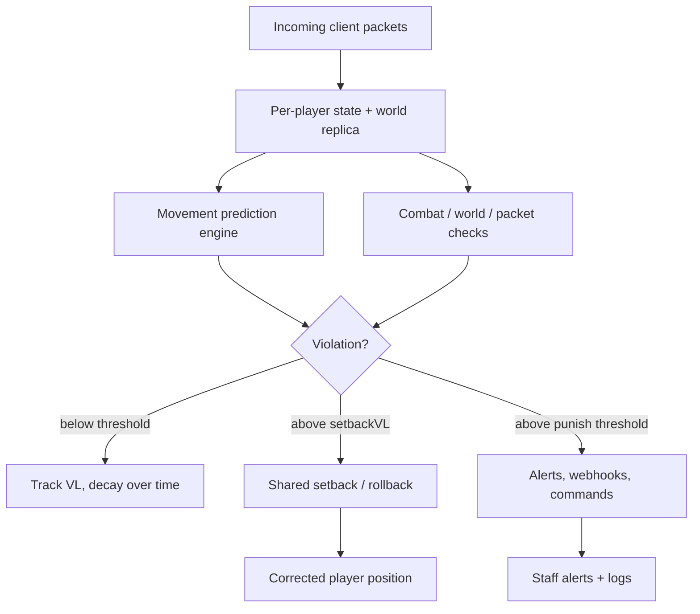

<a id="readme-top"></a>

<div align="center">
  <h1>CometAC</h1>

  <p><strong>A packet-level simulation anticheat for Minecraft, built for accuracy under real-world latency.</strong></p>
  <p>Movement prediction, combat and world checks, latency-compensated — Bukkit/Paper/Folia and Fabric, 1.8 through 1.21+.</p>

  <p>
    <a href="https://github.com/KaelusMC/CometAC/releases/latest"></a>
    <a href="https://github.com/KaelusMC/CometAC/releases"></a>
    <a href="https://github.com/KaelusMC/CometAC/actions"></a>
    <a href="https://modrinth.com/plugin/cometac"></a>
    <a href="LICENSE"></a>
  </p>

  <p>
    <a href="https://github.com/KaelusMC/CometAC/releases/latest"><strong>Download</strong></a>
    &nbsp;&bull;&nbsp;
    <a href="#quick-install"><strong>Install</strong></a>
    &nbsp;&bull;&nbsp;
    <a href="#features"><strong>Features</strong></a>
    &nbsp;&bull;&nbsp;
    <a href="#commands--permissions"><strong>Commands</strong></a>
    &nbsp;&bull;&nbsp;
    <a href="https://discord.cometac.ac"><strong>Discord</strong></a>
  </p>
</div>

> [!IMPORTANT]
> CometAC is an open-source anticheat that runs on the packet layer. It fully exempts Geyser/Bedrock players to avoid false positives, and supports Minecraft `1.8` through `1.21+` on Bukkit/Paper/Folia, plus Fabric `1.16.1+`.

---

## Features

<table>
  <tr>
    <td width="33%" valign="top"><strong>🧭 Movement simulation</strong><br><br>A 1:1 replay of every legal player movement — walking, swimming, knockback, cobwebs, bubble columns, and vehicles.</td>
    <td width="33%" valign="top"><strong>⚔️ Combat checks</strong><br><br>Reach, hitbox, aim, autoclicker, and triggerbot detection driven by reconstructed client state.</td>
    <td width="33%" valign="top"><strong>🌐 Per-player world replica</strong><br><br>Each player gets a compressed world copy, so fake blocks and block glitching never cause false flags.</td>
  </tr>
  <tr>
    <td width="33%" valign="top"><strong>⏱️ Latency compensation</strong><br><br>World changes, velocity, and flying state are queued until they actually reach the player.</td>
    <td width="33%" valign="top"><strong>🧵 Async, netty-thread design</strong><br><br>Movement checks and most listeners run off the main thread and scale to hundreds of players.</td>
    <td width="33%" valign="top"><strong>🎨 Configurable alerts</strong><br><br>Gradient prefix, verbose mode, proxy alert sharing, Discord webhooks, and 11 bundled languages.</td>
  </tr>
</table>

### What it catches

- Movement cheats — fly, speed, no-fall, timer, elytra, jesus, phase, and prediction offsets
- Combat cheats — killaura, reach, hitbox, autoclicker, triggerbot, aimbot, autoblock
- World cheats — scaffold, nuker, fast-place/break, baritone, ghost-block abuse
- Packet and protocol abuse — bad packets, crashers, post checks, packet-order violations

### What server owners get

- One drop-in plugin with PacketEvents bundled (or use a standalone PacketEvents)
- A tunable violation and punishment pipeline (thresholds, decay, setback control)
- Verbose debugging, session history, and per-check enable/disable via `checks.yml`
- Folia support and proxy alert forwarding out of the box

## How it works



Every check runs against reconstructed, latency-compensated player state. Violations raise a per-check violation level; crossing a check's `setbackVL` triggers the shared setback utility, and crossing a configured punishment threshold runs the alert/webhook/command actions defined in `punishments.yml`.

## Quick install

### Requirements

| Component | Requirement |
| --- | --- |
| Server software | Spigot, Paper, Folia, or Fabric |
| Minecraft | `1.8`–`1.21+` (Bukkit) · `1.16.1+` (Fabric) |
| Runtime | Java `17` or newer |
| Packets | [PacketEvents](https://github.com/retrooper/packetevents) — bundled in the release, or install standalone |

### Install in five steps

1. Download the latest [CometAC release](https://github.com/KaelusMC/CometAC/releases/latest) for your platform (Bukkit or Fabric).
2. Drop the jar into your server's `plugins/` folder (or `mods/` for Fabric).
3. If you run a proxy with Geyser, install Floodgate on the backend server where CometAC runs.
4. Start the server once to generate the config, then restart or reload after editing.
5. Give staff the `cometac.alerts` permission and join to confirm alerts work.

Expected layout on Bukkit:

```text
plugins/
`-- CometAC/
    |-- config/          # language configs (en, de, es, ...)
    |-- messages/        # alert + command strings (gradient prefix lives here)
    |-- checks.yml       # per-check enable/disable + thresholds
    `-- punishments.yml  # violation thresholds -> commands
```

## Commands & permissions

The base command is `/cometac` (alias `/comet`). Every subcommand keeps the `cometac.*` permission structure.

| Command | Permission | Description |
| --- | --- | --- |
| `/cometac alerts` | `cometac.alerts` | Toggle violation alerts for yourself |
| `/cometac verbose` | `cometac.verbose` | Toggle verbose (every-flag) output |
| `/cometac brands` | `cometac.brand` | Toggle client-brand-on-join messages |
| `/cometac profile <player>` | `cometac.profile` | Show a player's violation profile |
| `/cometac history` | `cometac.list` | Browse stored violation sessions |
| `/cometac performance` | `cometac.performance` | Show anticheat performance metrics |
| `/cometac reload` | `cometac.reload` | Reload config, messages, and checks |
| `/cometac spectate <player>` | `cometac.spectate` | Spectate a suspected player |
| `/cometac version` | `cometac.version` | Show the running CometAC version |

Useful exemption nodes: `cometac.exempt` (all checks), `cometac.exempt.<check>` (one check), `cometac.nosetback`, and `cometac.nomodifypacket`.

## Alerts & branding

The alert prefix is a dark-to-light blue `CometAC` gradient, defined in `messages/<lang>.yml`:

```yaml
prefix: "<gradient:#1565c0:#5cd6ff><bold>CometAC</bold></gradient> &8»"
```

Prefixes and messages support both legacy `&` color codes and full [MiniMessage](https://docs.advntr.dev/minimessage/format.html) tags, so you can re-theme the whole plugin from one file.

## Common problems

| Problem | Check this |
| --- | --- |
| Plugin does not load | Java 17+, PacketEvents present (or bundled build), correct platform jar |
| No alerts appear | You have `cometac.alerts` and alerts are toggled on (`/cometac alerts`) |
| Bedrock players get flagged | Confirm Floodgate is on the backend server so Geyser players are exempt |
| Everyone gets false setbacks | Review `checks.yml` thresholds; raise `setbackvl` for the noisy check |
| ViaVersion issues on a proxy | Install ViaVersion on the backend only, never on the proxy |
| Prefix shows raw tags | Make sure `messages/<lang>.yml` was regenerated after updating |

## Compiling from source

```bash
git clone https://github.com/KaelusMC/CometAC.git
cd CometAC
./gradlew build          # or: ./gradlew :bukkit:shadowJar
```

Built jars land in `bukkit/build/libs/` and `fabric/build/libs/` as `cometac-<platform>-<version>.jar`.

## License

Distributed under the [GPL-3.0 License](LICENSE). Copyright and license notices are preserved in the source tree; any redistributed or modified build must remain GPL-3.0 with source available.

<p align="right">(<a href="#readme-top">back to top</a>)</p>
